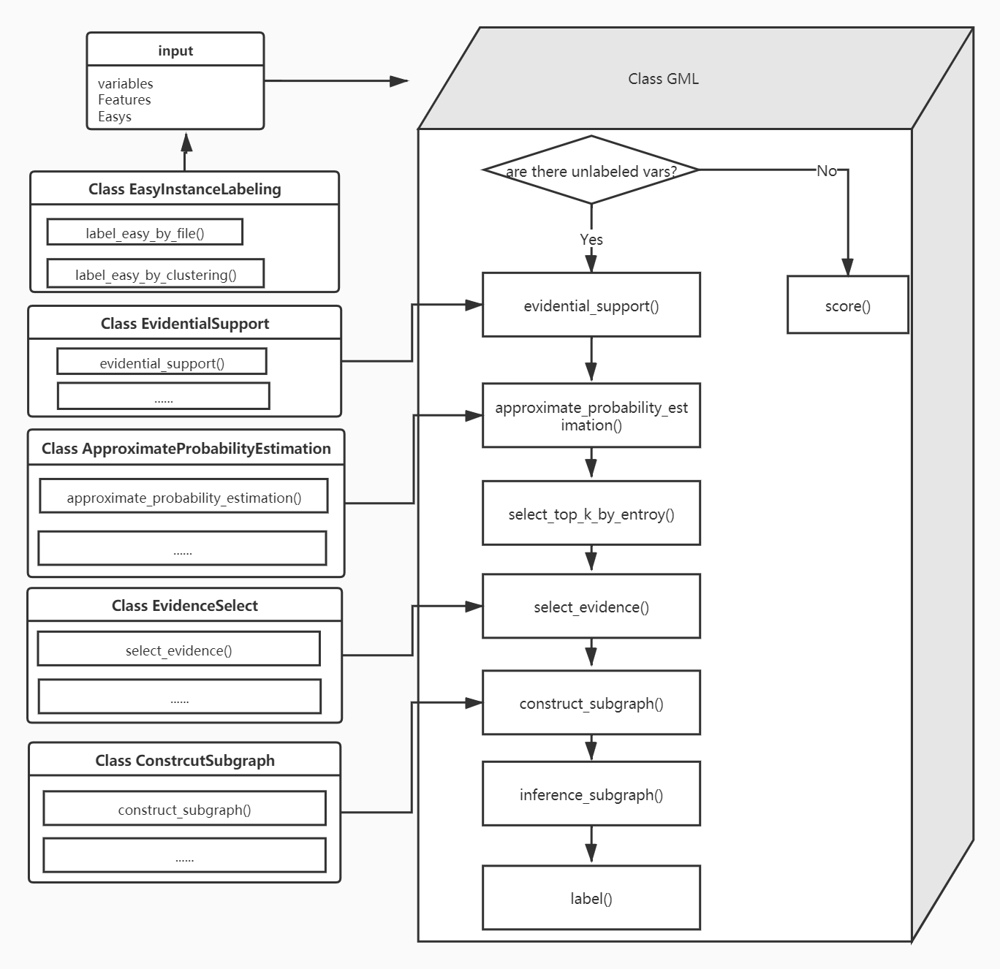

<p></p>     
--------------------------------------------------------------------------------

# Gradual Machine Learning(GML) framework
English | [简体中文](./README-zh_CN.md)                

gml is a Python package that provides for Gradual Machine Learning


  - [Introuduction](#introuduction)
  - [Installation](#installation)
  - [Usage](#usage)
  - [API](#api)
  - [FAQ](#faq)
  - [Contributing](#contributing)
  - [Related Efforts](#related-efforts)
  - [The Team](#the-team)
  - [License](#license)
 

## Introuduction
   ### Goal
   Gradual machine learning mainly includes three modules: simple instance recognition, feature extraction and influence modeling and progressive reasoning. For different domain tasks, simple instance recognition, feature extraction, and influence modeling techniques are quite different. For this, we will set up a common interface for users to use. Incremental reasoning is the most important module in the progressive machine learning framework. Its core principle is shared by all tasks, so we encapsulate it into a directly callable interface and open source the code on GitHub for user reference. Based on the R & D progressive machine learning platform, users only need to generate data according to the set interface, and provide the corresponding constraints, they can use the asymptotic machine learning framework for inference. Specifically, users need to provide specific simple instance labeling and feature extraction techniques according to different tasks; then call the progressive inference module to perform inference directly. It should be noted that the progressive inference module includes three steps: evidence support estimation, entropy approximate calculation, and inference subgraph construction. They may vary according to different tasks, so if the open source project provides methods that cannot meet user needs , Users can customize related methods. For the development of an open source platform for asymptotic machine learning, we use the open source factor graph inference tool Numbskull released by Stanford University as the basis, and combine the different needs of entity recognition and sentiment analysis to modify the Numbskull source code. The original version of Numbskull only supports the reasoning of a single parameter of the factor, and the modified Numbskull can support the functionalization of the parameter of the factor. The open source platform for asymptotic machine learning will be used as a core tool for incremental reasoning to complete the parameter learning.
   ### Theory
   Gradual machine learning framework draws on the human learning model from easy to difficult. First, the machine automatically completes the labeling of simple instances in the task, and then gradually completes the labeling of the harder instances based on factor graph reasoning. Unlike deep learning, progressive machine learning does not require independent and identical distribution assumptions, and requires little or no manual labeling of data. The progressive machine learning framework includes three modules: simple instance recognition, key feature extraction and influence modeling, and progressive reasoning.
   #### Easy Instance Labeling
   Given a classification task, if there is not enough training data, it is often difficult to accurately mark all instances in the task. However, if we only need to simply label simple instances in the task, then the situation will become easier. In actual scenarios, simple instance labeling can be performed simply according to user-specified rules or existing unsupervised learning techniques. For example, unsupervised clustering. Progressive machine learning begins with the labeling results of simple instance labels. Therefore, high-precision labeling of simple examples is critical to the final performance of progressive machine learning in a given task.
   #### Feature Extraction and Influence Modeling
   The characteristic is the medium that transfers information between simple and complex instances. In this step, we need to extract the features shared by the marked simple instance and the unmarked complex instance. To facilitate the transfer of effective information between instances, we extract different kinds of features to capture as much information as possible. For the extracted features, we need to further model their influence on instance annotation.
   #### Gradual Inference
   In this step, we will gradually mark complex instances. Through iterative factor graph inference, parameter learning is performed on the factor graph. In each iteration, we select the unlabeled instance with the highest degree of evidence certainty for labeling. Iterate repeatedly until all instances in the task are marked. It is worth noting that in progressive reasoning, the newly marked instances in the current iteration will be used as evidence in subsequent iterations.
   ### Flowchat
   <p></p>    


## Installation
    pip install gml
## Usage
 Before using this framework, you need to prepare your data according to the following [Data structure description](./docs/data_structures.md) .

After preparing the data, you can use this framework as follows.
First you need to prepare a configuration file.
``` python 
[para]
dataname =dblp
top_m = 2000 
top_k = 10
top_n = 1
n_process = 1
update_proportion = 0.01
optimization_threshold = 1e-6
balance = True
optimization = True
learning_epoches = 800
inference_epoches = 800
learning_method = sgd
out = True
```      
  ```python            
import pickle
import time
import warnings
from easy_instance_labeling import EasyInstanceLabeling
from gml import  GML
from gml_utils import *

if __name__ == '__main__':
    warnings.filterwarnings('ignore')  # 过滤掉warning输出
    begin_time = time.time()
    # 1.准备数据 
    dataname = "dblp"
    dir = '../'
    with open(dir+"data/"+dataname+'_variables.pkl', 'rb') as v:
        variables = pickle.load(v)
    with open(dir+"data/"+dataname+'_features.pkl', 'rb') as f:
        features = pickle.load(f)
       #修正数据中乱标的错误
    for variable in variables:
        variable['is_evidence'] = False
        variable['is_easy'] = False
        variable['label'] = -1
       #标注Easy
    easys = load_easy_instance_from_file(dir+"data/"+dataname+"_easys.csv")
    EasyInstanceLabeling(variables, features, easys).label_easy_by_file()
    #2. 初始化因子图，设置参数
    graph = GML.initial("./er.config",variables,features)
    #3. 因子图推理
    graph.inference()
    #4. 输出推理用时
    end_time = time.time()
    print('Running time: %s Seconds' % (end_time - begin_time))

```               
Here is an [example](examples/er_example.py) you can refer.
## API
<details>
    <summary>Easy Instance Labeling</summary>
  
* [EasyInstanceLabeling](./docs/easy_instance_labeling.md "Perform simple instance labeling based on simple user-specified rules or existing unsupervised learning techniques")
    * [label_easy_by_file](./docs/easy_instance_labeling.md "Mark Easy in variables according to the provided easy list")
    * [label_easy_by_clustering](./docs/easy_instance_labeling.md "Easy instance labeling through clustering")
    * [label_easy_by_custom](./docs/easy_instance_labeling.md "Easy example labeling through user-defined")
</details>

<details>
  <summary>Influence Modeling</summary>

* [class EvidentialSupport](./docs/evidential_support.md "Evidence-supported method set")
    * [get_unlabeled_var_feature_evi](./docs/evidential_support.md "Calculate the ratio of 0 to 1 in the evidence variable associated with each unary feature of each hidden variable, and the variable id at the other end of the binary feature")
    * [separate_feature_value](./docs/evidential_support.md "Select the easy feature value of each feature for linear regression")
    * [create_csr_matrix](./docs/evidential_support.md "Create a sparse matrix to store all featureValue of all variables for subsequent calculation of Evidential Support")
    * [influence_modeling](./docs/evidential_support.md "Perform linear regression on the updated feature, save all the results of the regression back to the feature, the key is 'regression' ")
    * [init_tau_and_alpha](./docs/evidential_support.md "Calculate tau and alpha parameters for a given feature")
    * [evidential_support_by_regression](./docs/evidential_support.md "Calculate the Evidential Support parameters of all hidden variables")
    * [get_dict_rel_acc](./docs/evidential_support.md "Calculate the accuracy of different types of relationships")
    * [construct_mass_function_for_propensity](./docs/evidential_support.md "Build mass function for Evidential Support calculation in Aspect-level sentiment analysis application")
    * [labeling_propensity_with_ds](./docs/evidential_support.md "Different types of evidences are combined in different ways for aspect-level sentiment analysis")
    * [evidential_support_by_relation](./docs/evidential_support.md "Calculate the essential support of each hidden variable in a given set of hidden variables, suitable for Aspect-level sentiment analysis")
    * [evidential_support_by_custom](./docs/evidential_support.md "User-defined method for calculating essential support ")
* [class Regression](./docs/evidential_support.md "Linear regression related class, perform linear regression on all features, used for the essential support calculation of Entity Resolution")
    * [perform](./docs/evidential_support.md "Perform linear regression method for Entity Resolution")
</details>

<details>
  <summary>Gradual Inference</summary>

* [class GML](./docs/gml.md "Progressive machine learning main process")
    * [evidential_support](./docs/gml.md "Calculation essential support")
    * [approximate_probability_estimation](./docs/gml.md "Calculate approximate probability")
    * [select_top_m_by_es](./docs/gml.md "Select the top m hidden variables according to the calculated Evidential Support (large to small)")
    * [select_top_k_by_entropy](./docs/gml.md "Calculate entropy, select top_k hidden variables with small entropy")
    * [select_evidence](./docs/gml.md "Select the edges, variables and features needed for subsequent subgraph construction")
    * [construct_subgraph](./docs/gml.md "After selecting topk hidden variables, create a subgraph")
    * [inference_subgraph](./docs/gml.md "Inference subgraph")
    * [label](./docs/gml.md "Compare the entropy of k hidden variables, select the one with the smallest entropy and label it, and write the parameters learned from this graph back to self.features")
    * [inference](./docs/gml.md "Main process")
    * [score](./docs/gml.md "Calculate the accuracy rate, precision rate, recall rate, f1 value of inference results, etc.")
* [gml_utils](./docs/gml_utils.md "全局函数集合")
    * [load_easy_instance_from_file](./docs/gml_utils.md "Load easy from csv file")
    * [separate_variables](./docs/gml_utils.md "Divide variables into evidence variables and hidden variables")
    * [init_evidence_interval](./docs/gml_utils.md "Initial evidence interval")
    * [init_evidence](./docs/gml_utils.md "Initialize the witness_interval and witness_count attributes of all features")
    * [write_labeled_var_to_evidence_interval](./docs/gml_utils.md "Because each featurew maintains the evidence_interval attribute, this attribute needs to be updated after each variable is marked")
    * [entropy](./docs/gml_utils.md "Calculate entropy after given probability")
    * [open_p](./docs/gml_utils.md "Weight calculation formula")
    * [combine_evidences_with_ds](./docs/gml_utils.md "Aggregate evidence from different sources")
* [class ApproximateProbabilityEstimation](./docs/approximate_probability_estimation.md "Set of methods for approximate probability calculation")
    * [init_binary_feature_weight](./docs/approximate_probability_estimation.md "Set initial value of binary feature weight")
    * [labeling_conflict_with_ds](./docs/approximate_probability_estimation.md "Evidence support based on (D-S) theory measurement")
    * [get_pos_prob_based_relation](./docs/approximate_probability_estimation.md "Calculate the proportion of positive instances in marked instances with a feature")
    * [construct_mass_function_for_confict](./docs/approximate_probability_estimation.md "Evidence support for calculating each feature connected to an unlabeled variable")
    * [approximate_probability_estimation](./docs/approximate_probability_estimation.md "Calculate the approximate probability of the selected topm hidden variables, used to select topk")
    * [approximate_probability_estimation_by_custom](./docs/approximate_probability_estimation.md "Calculate the approximate probability of the selected topm hidden variables, used to select topk, user-defined calculation rules")
* [class EvidenceSelect](./docs/evidence_select.md "Select evidence variables for latent variable reasoning")
    * [select_evidence](./docs/evidence_select.md "Select evidence variables for latent variable reasoning")
    * [select_evidence_by_custom](./docs/evidence_select.md "Select evidence variables for hidden variable reasoning, user-defined selection method")
* [construct_subgraph](./docs/construct_subgraph.md "Construct factor graph")
    * [construct_subgraph](./docs/construct_subgraph.md "A unified method for constructing factor graphs")
    * [construct_subgraph_for_mixture](./docs/construct_subgraph.md "Construct factor graph, suitable for ER")
    * [construct_subgraph_for_unaryPara](./docs/construct_subgraph.md "Construct factor graphs for ALSA")
    * [construct_subgraph_for_custom](./docs/construct_subgraph.md "Construction factor graph, user-defined construction method")
* [how to use numbskull](./docs/how%20to%20use%20numbskull.md "how to use numbskull")
</details>
 
## FAQ
  FAQ
## Contributing
  We appreciate all contributions. If you are planning to contribute back bug-fixes, please do so without any further discussion.
  If you plan to contribute new features, utility functions or extensions to the core, please first open an issue and discuss the feature with us
## Related Efforts
  ### [Gradual Machine Learning for Entity Resolution](https://github.com/gml-explore/GML_for_ER)  
  Usually considered as a classification problem, entity resolution (ER) can be very challenging on real data due to the prevalence of dirty values. The state-of-the-art solutions for ER were built on a variety of learning models (most notably deep neural networks), which require lots of accurately labeled training data. Unfortunately, high-quality labeled data usually require expensive manual work, and are therefore not readily available in many real scenarios. In this paper, we propose a novel learning paradigm for ER, called gradual machine learning, which aims to enable effective machine labeling without the requirement for manual labeling effort. It begins with some easy instances in a task, which can be automatically labeled by the machine with high accuracy, and then gradually labels more challenging instances by iterative factor graph inference. In gradual machine learning, the hard instances in a task are gradually labeled in small stages based on the estimated evidential certainty provided by the labeled easier instances. Our extensive experiments on real data have shown that the performance of the proposed approach is considerably better than its unsupervised alternatives, and highly competitive compared to the state-of-the-art supervised techniques. Using ER as a test case, we demonstrate that gradual machine learning is a promising paradigm potentially applicable to other challenging classification tasks requiring extensive labeling effort.
  ### [Gradual Machine Learning for Aspect-level Sentiment Analysis](https://github.com/gml-explore/GML_for_ALSA) 
  The state-of-the-art solutions for Aspect-Level Sentiment Analysis (ALSA) are built on a variety of deep neural networks (DNN), whose efficacy depends on large amounts of accurately labeled training data. Unfortunately, highquality labeled training data usually require expensive manual work, and are thus not readily available in many real scenarios. In this paper, we aim to enable effective machine labeling for ALSA without the requirement for manual labeling effort. Towards this aim, we present a novel solution based on the recently proposed paradigm of gradual machine learning. It begins with some easy instances in an ALSA task, which can be automatically labeled by the machine with high accuracy, and then gradually labels the more challenging instances by iterative factor graph inference. In the process of gradual machine learning, the hard instances are gradually labeled in small stages based on the estimated evidential certainty provided by the labeled easier instances. Our extensive experiments on the benchmark datasets have shown that the performance of the proposed approach is considerably better than its unsupervised alternatives, and also highly competitive compared to the state-of-the-art supervised DNN techniques

## The Team
> [@Anqi4869](https://github.com/Anqi4869)                        
> [@buglesxu](https://github.com/buglesxu)                      
> [@chenyuWang](https://github.com/DevelopingWang)                 
> [@hxlnwpu](https://github.com/hxlnwpu)                  
> [@zhanghan97](https://github.com/zhanghan97)  
## License
  [Apache License 2.0](LICENSE)

